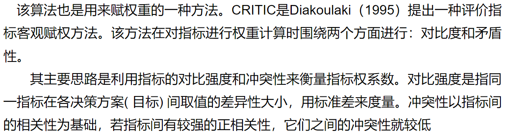
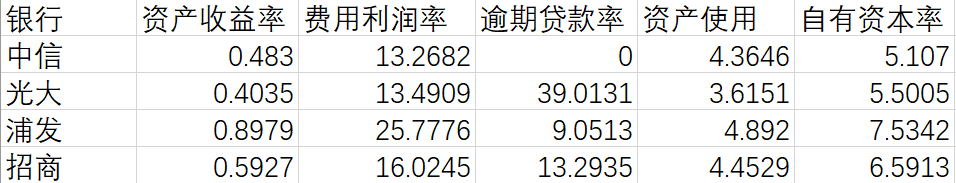
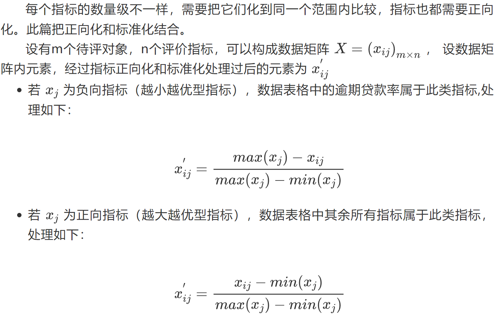
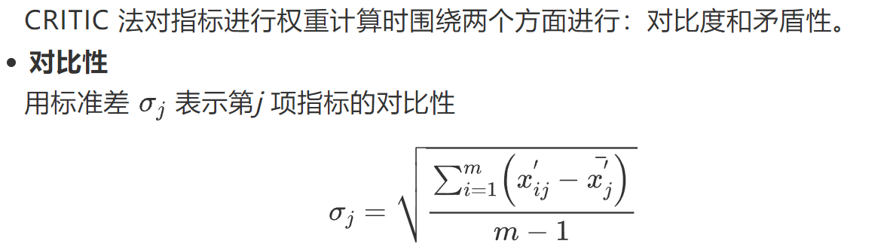
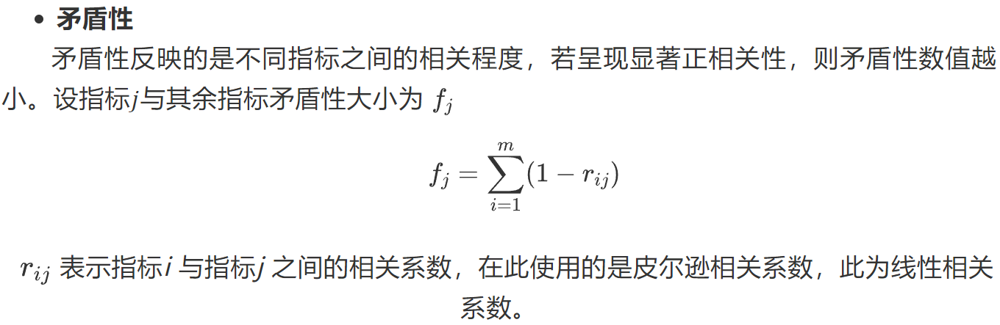
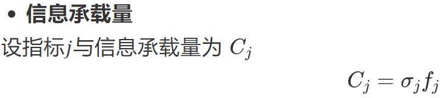
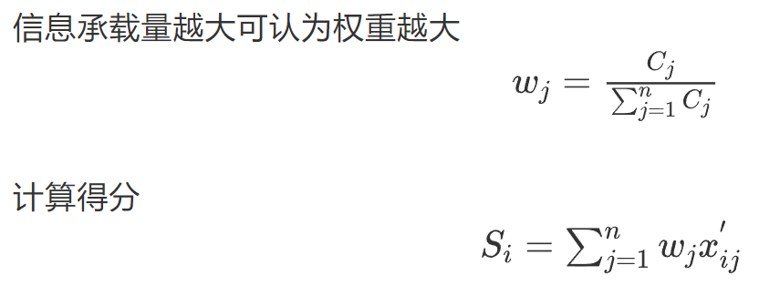

# CRITIC 法 -> 赋权重的方法

## 算法介绍

## 实例

有中信、光大、浦发、招商四个银行。对它们的资产收益率、费用利润率、逾期贷款率、资产使用、自有资本率分别进行评价。

### 数据

### 算法

1. 指标正向化与标准化

2. 信息承载量计算
    1. 对比性
   
    

    2. 矛盾性
    
    

    3. 信息承载量

    

3. 计算权重与得分

