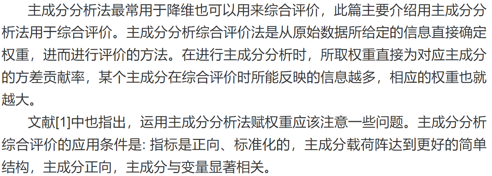
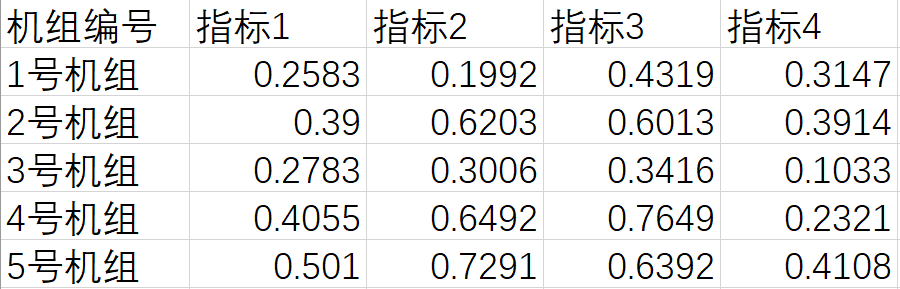
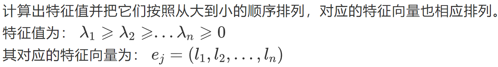
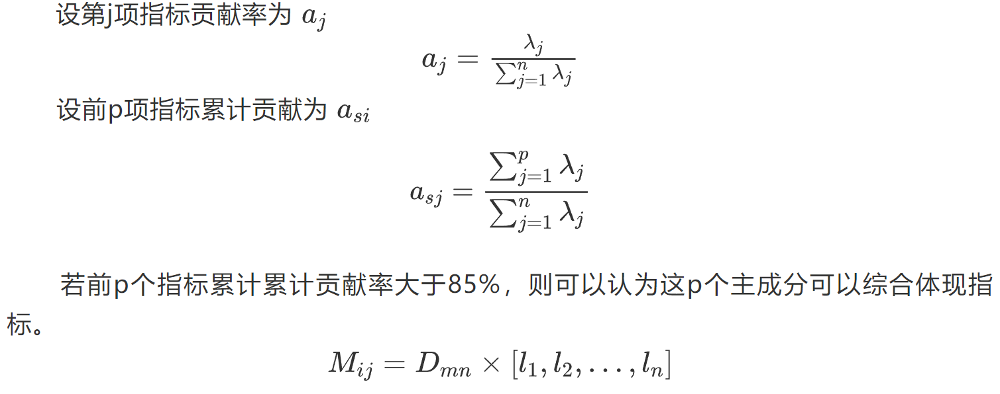

# 主成分分析法

## 算法介绍

## 实例

现有1~5号机组，对它们的指标1（可靠性），指标2（经济性），指标3（技术性），指标4（运行性）进行综合评价。

### 数据表格

### 算法

1. 指标正向化与标准化 -> z-score 法 -> 类似于正态标准化
2. 主成分分析

    1. 计算相关系数矩阵 R -> pearson
   
        计算相关系数矩阵R，使用皮尔逊相关系数计算各指标间的相关系数，即列与列之间的相关系数。
        
    2. 计算 R 的特征值和特征向量
   
    

    3. 计算主成分贡献率及累计贡献率

    

3. 计算得分

