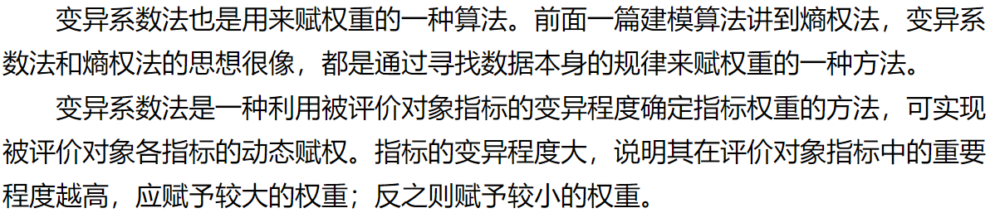
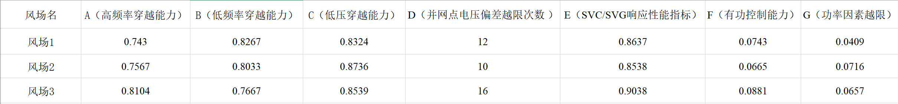
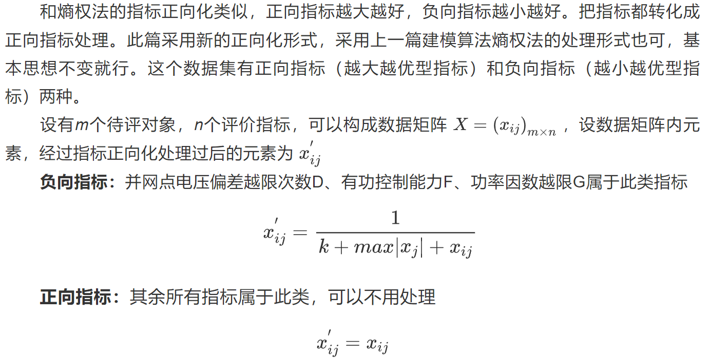
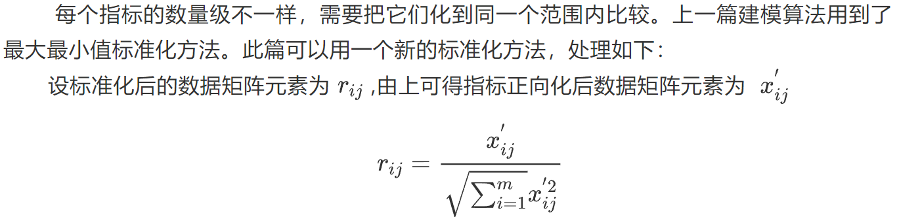
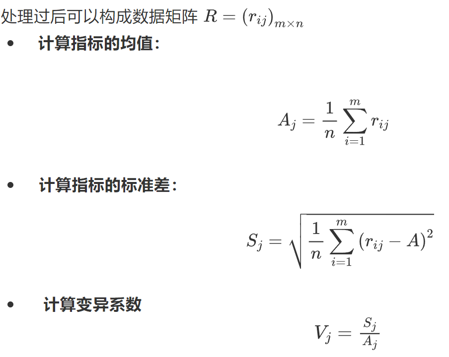
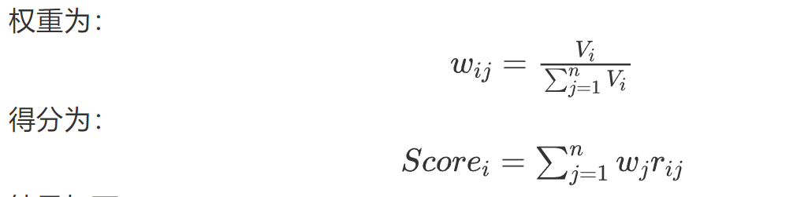

# 变异系数法

## 算法介绍 -> 赋权重的方法

## 实例

### 数据介绍
针对高频率穿越能力、低频率穿越能力、低压穿越能力、并网点电压偏差越限次数、SVC/SVG响应性能指标、有功控制能力、功率因素越限几个指标进行评价，为方便处理把这些指标依次设置为A~G。

### 算法

1. 指标正向化

2. 数据标准化

3. 计算变异系数

4. 计算权重
5. 计算得分
