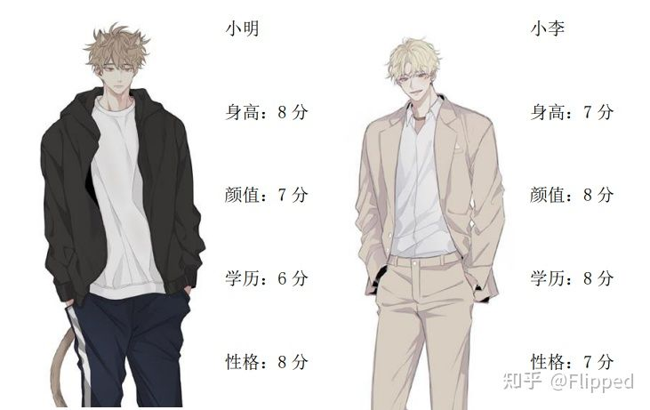
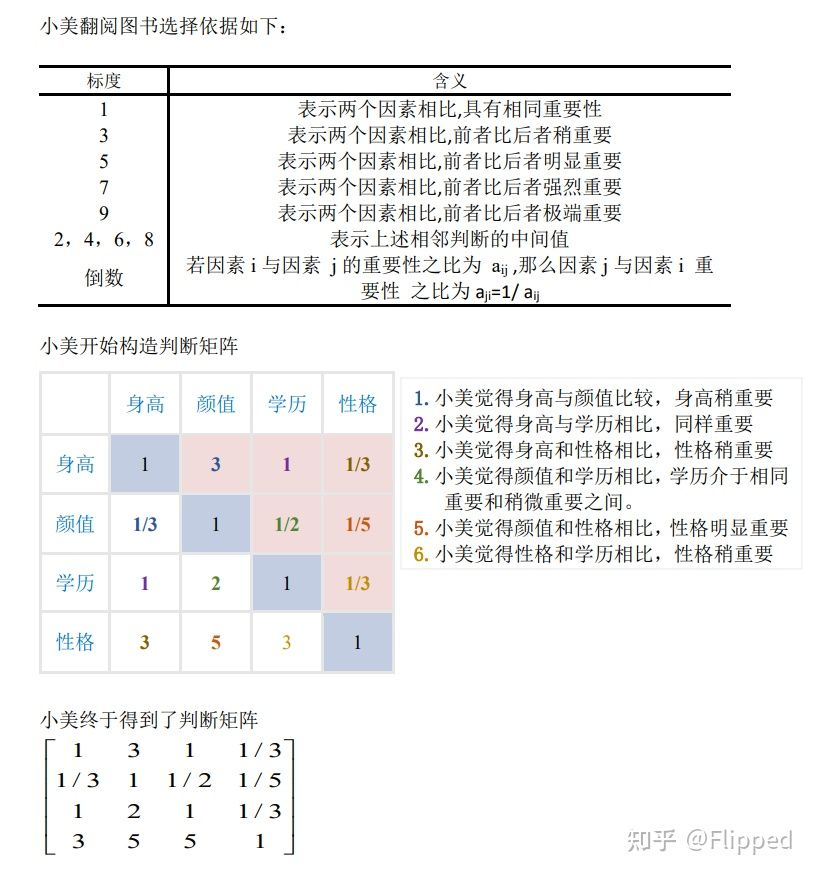
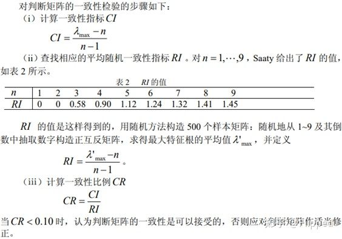
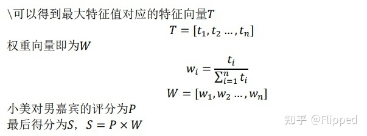

# AHP Method

## S1: 创造指标, 并对各个指标进行打分

## S2: 根据各个指标之间的关系创造判断矩阵

## S3: 对判断矩阵求解进行检验

    1.确定指标个数 n
    2.求解判断矩阵的特征值 & 特征向量
    3.找到最大特征值 & 所对应的特征向量
    4.由最大特征值求解一致性检验指标 CI
    5.计算一致性比例 $CR = \frac{CI}{RI}$
    6. CR < 0.1 判断矩阵一致性可以接受

## S4: 计算打分

    1. 最大特征值对应的特征向量
    2. 计算权重下改良
    3. 综合打分 = 分别打分 * 权重向量

## S5: 代码

