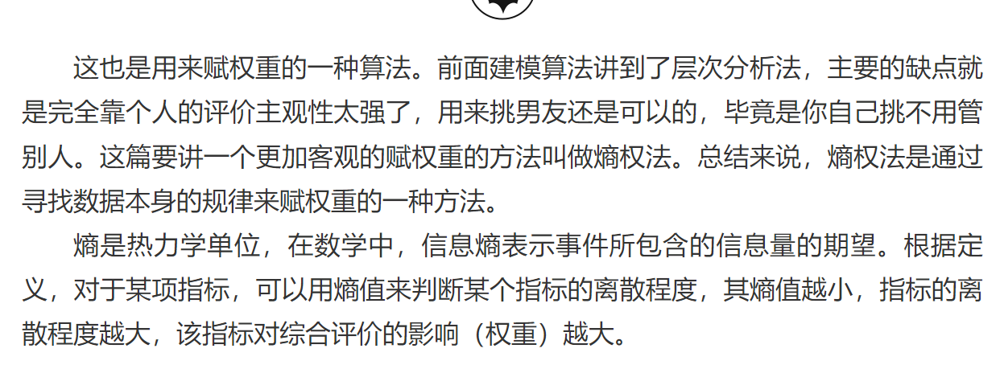
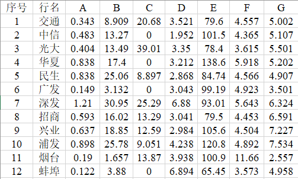
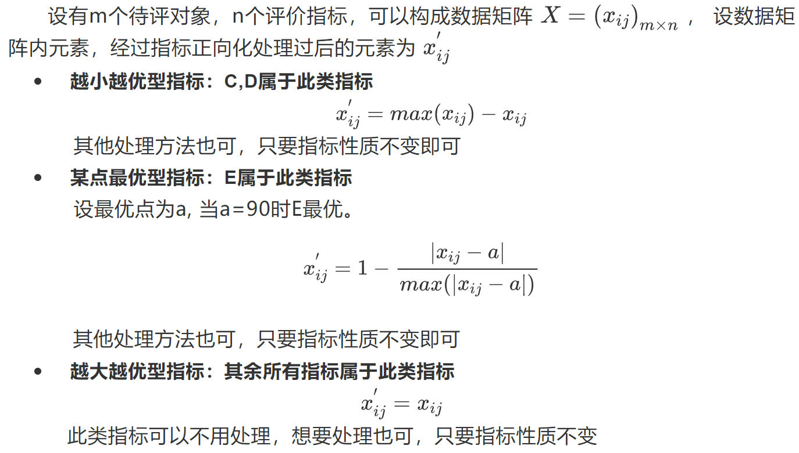
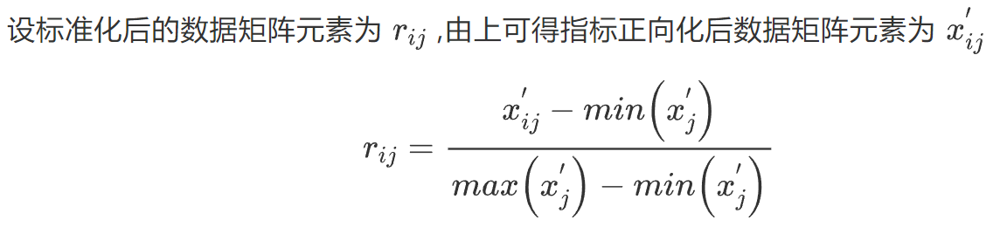
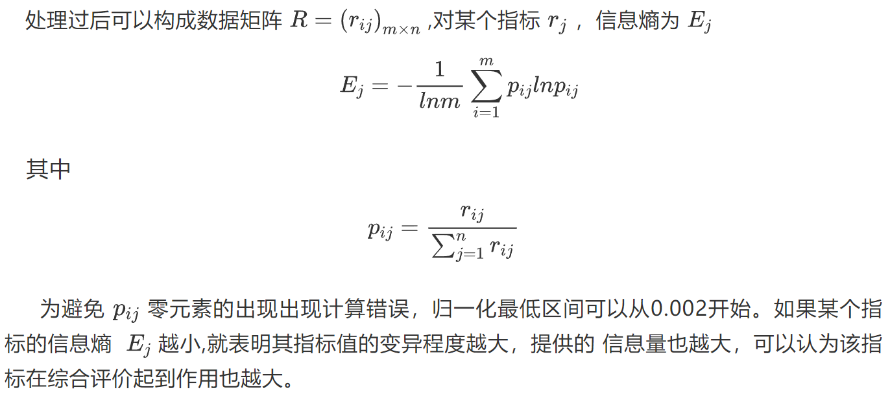

# 熵权法 -> 弥补层次分析法过于主观的缺点

## S1: 算法用途

## S2: 实例介绍

> 设资产收益率为A，费用利润率为B，逾期贷款率为C，非生息资产率为D，流动性比率为E，资产使用率为F，自有资本率为G。以此对12个银行进行评分,数据表格如下：

## S3: 算法原理

> 1. 指标正向化: 有的指标越大越好, 有的指标越小越好, 为方便, 将所有指标转化为"越大越优型指标", 称为正向化处理

> 2. 数据标准化 -> 将所有大小不一的指标进行标准化

> 3. 计算信息熵

> 4. 计算权重与得分

      

