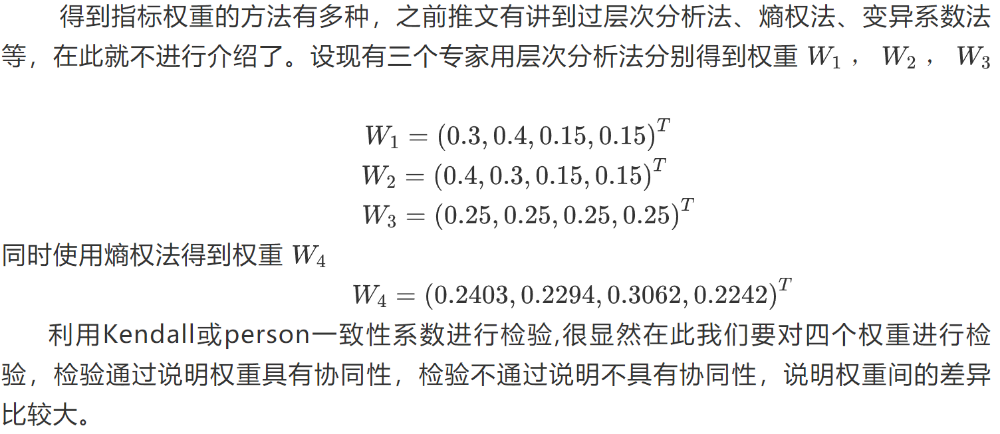

# 组合权重法

## 算法介绍

## 实例分析
一个客户要选择机器人，有四个可选择的方案，每个方案有四个指标，分别是：P1表示价格，P2表示速度，P3表示可重复性，P4表示负载能力。针对这四个指标对每一个方案进行综合评价得到最优方案。

### 数据表格

### 算法

1. 指标正向化 & 标准化

2. 组合权重

    一致性检验通过

    一致性检验不通过

3. 计算得分

4. pearson 相关系数检验

